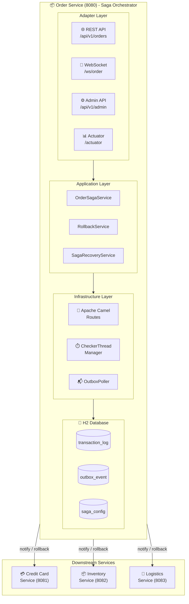
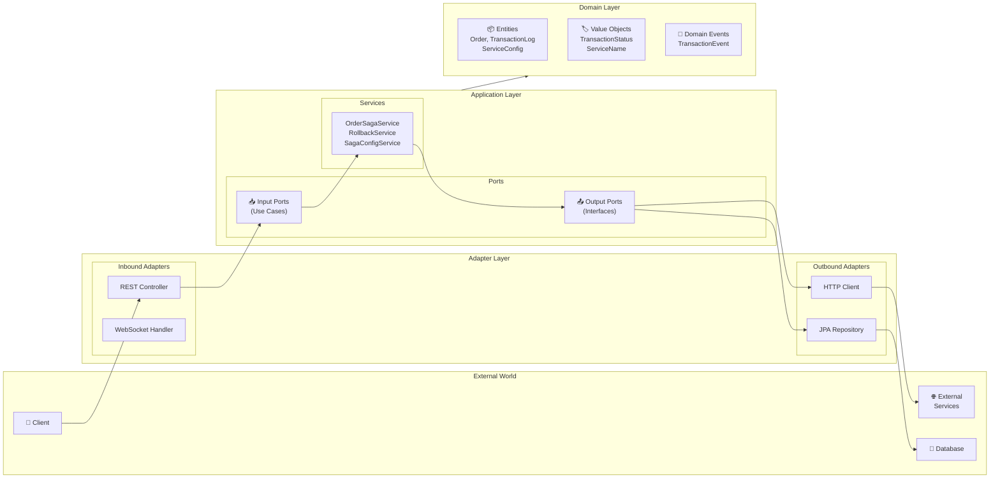
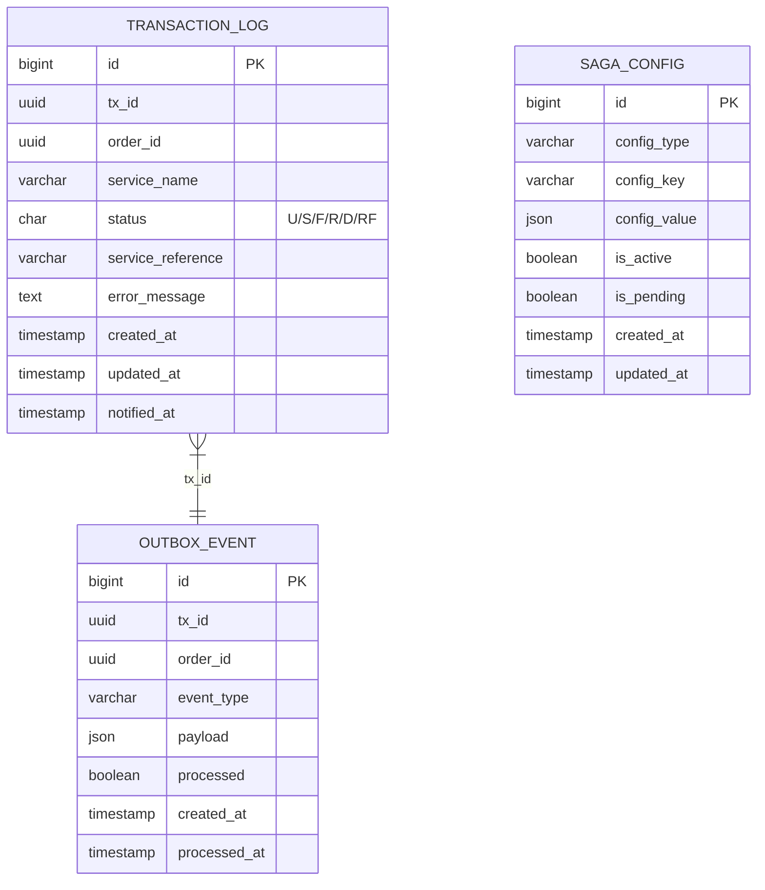
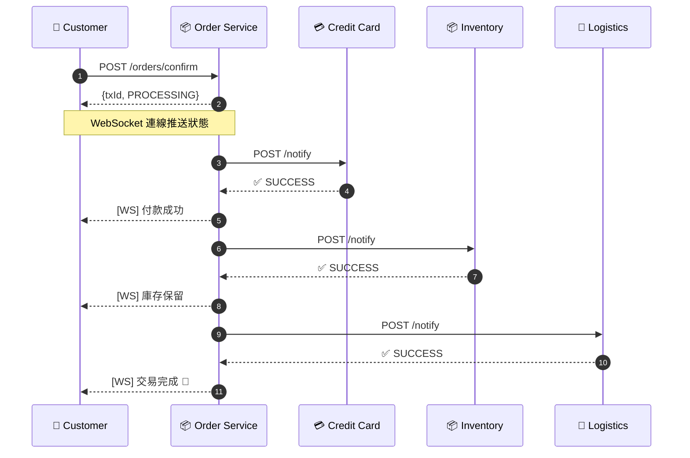
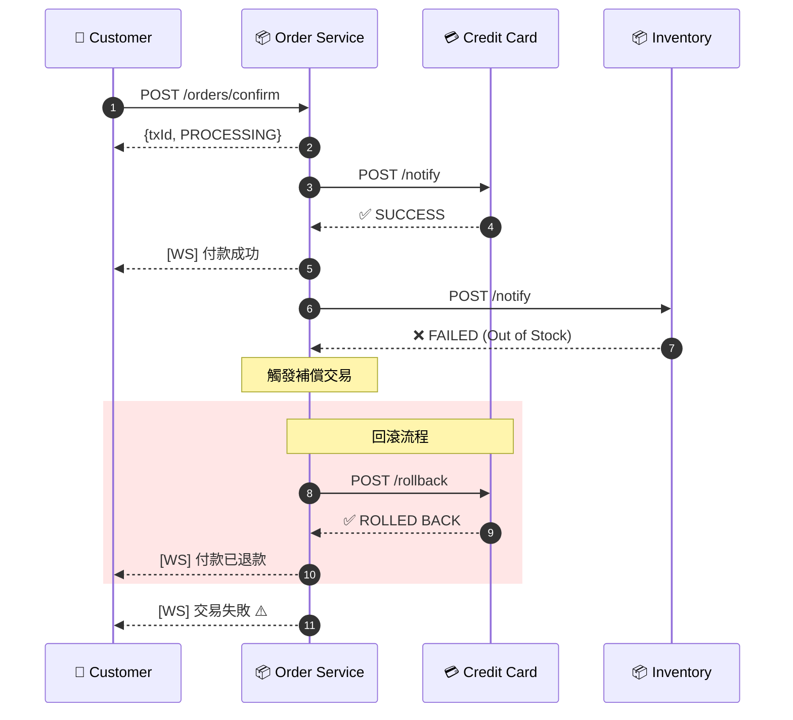
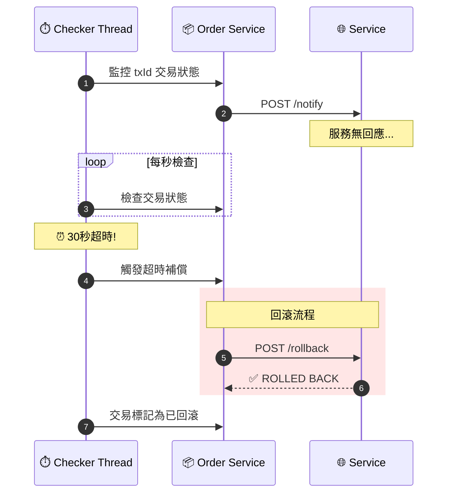

# E-Commerce Saga Orchestration System

電子商務 Saga 編排系統 - 使用 Saga 模式實現分散式交易的自動補償機制。

## 專案狀態


| 階段 | 狀態 | 說明 |
|------|------|------|
| Phase 1-3 | ✅ 完成 | 基礎架構、領域模型、端口與適配器 |
| Phase 4 | ✅ 完成 | 回滾機制與 Camel 路由 |
| Phase 5 | ✅ 完成 | 超時檢測與自動補償 |
| Phase 6 | ✅ 完成 | 回滾失敗升級通知 |
| Phase 7 | ✅ 完成 | 服務重啟後恢復 |
| Phase 8 | ✅ 完成 | 動態服務配置 API |
| Phase 9 | ✅ 完成 | 可觀測性與驗收測試 |

---

## 系統架構



### 六角形架構 (Hexagonal Architecture)



---

## 技術棧

| 類別 | 技術 | 版本 | 用途 |
|------|------|------|------|
| **語言** | Java | 21 | 主要開發語言 |
| **框架** | Spring Boot | 3.2.x | 應用程式框架 |
| **編排引擎** | Apache Camel | 4.x | Saga 流程編排 |
| **資料庫** | H2 Database | - | 嵌入式資料庫 (事件溯源) |
| **ORM** | Spring Data JPA | - | 資料存取層 |
| **即時通訊** | WebSocket | - | 交易狀態即時推送 |
| **API 文件** | SpringDoc OpenAPI | 2.x | Swagger UI |
| **監控** | Micrometer + Actuator | - | 指標收集與健康檢查 |
| **建置工具** | Gradle | 8.5 | 專案建置管理 |
| **測試** | JUnit 5 + Mockito | - | 單元/整合測試 |

---

## 資料庫設計

### ER Diagram



### 交易狀態 (TransactionStatus)

| 狀態碼 | 名稱 | 說明 |
|--------|------|------|
| `U` | UNKNOWN | 處理中/未知 |
| `S` | SUCCESS | 成功完成 |
| `F` | FAILED | 執行失敗 |
| `R` | ROLLED_BACK | 已回滾 |
| `D` | DONE | 交易完成 (含回滾) |
| `RF` | ROLLBACK_FAILED | 回滾失敗 |

---

## API 清單

### Order Service (Port 8080)

#### 訂單 API

| Method | Endpoint | 說明 |
|--------|----------|------|
| `POST` | `/api/v1/orders/confirm` | 確認訂單，啟動 Saga 流程 |
| `GET` | `/api/v1/transactions/{txId}` | 查詢交易狀態 |

#### 管理員配置 API

| Method | Endpoint | 說明 |
|--------|----------|------|
| `GET` | `/api/v1/admin/config/active` | 取得當前生效配置 |
| `GET` | `/api/v1/admin/config/pending` | 取得待生效配置 |
| `PUT` | `/api/v1/admin/config/pending` | 更新待生效配置 |
| `POST` | `/api/v1/admin/config/apply` | 套用待生效配置 |
| `DELETE` | `/api/v1/admin/config/pending` | 捨棄待生效配置 |
| `GET` | `/api/v1/admin/config/timeouts` | 取得服務超時設定 |
| `GET` | `/api/v1/admin/config/order` | 取得服務執行順序 |

#### WebSocket

| Endpoint | 說明 |
|----------|------|
| `ws://localhost:8080/ws/order/{txId}` | 訂閱交易狀態更新 |

#### Actuator 端點

| Endpoint | 說明 |
|----------|------|
| `/actuator/health` | 健康檢查 |
| `/actuator/info` | 應用程式資訊 |
| `/actuator/metrics` | 指標數據 |
| `/actuator/prometheus` | Prometheus 格式指標 |

### 下游服務 API

| Service | Port | Notify Endpoint | Rollback Endpoint |
|---------|------|-----------------|-------------------|
| Credit Card | 8081 | `POST /api/v1/credit-card/notify` | `POST /api/v1/credit-card/rollback` |
| Inventory | 8082 | `POST /api/v1/inventory/notify` | `POST /api/v1/inventory/rollback` |
| Logistics | 8083 | `POST /api/v1/logistics/notify` | `POST /api/v1/logistics/rollback` |

---

## Swagger UI

啟動服務後，可透過以下網址存取 API 文件：

| 服務 | Swagger UI URL |
|------|----------------|
| Order Service | http://localhost:8080/swagger-ui.html |
| API Docs (JSON) | http://localhost:8080/api-docs |

### 使用範例

```bash
# 1. 確認訂單
curl -X POST http://localhost:8080/api/v1/orders/confirm \
  -H "Content-Type: application/json" \
  -d '{
    "orderId": "550e8400-e29b-41d4-a716-446655440000",
    "userId": "user-123",
    "items": [
      {"sku": "SKU-001", "quantity": 2, "unitPrice": 29.99}
    ],
    "totalAmount": 59.98,
    "creditCardNumber": "4111111111111111"
  }'

# Response:
# {"txId": "a1b2c3d4-...", "status": "PROCESSING"}

# 2. 查詢交易狀態
curl http://localhost:8080/api/v1/transactions/{txId}

# 3. 取得服務配置
curl http://localhost:8080/api/v1/admin/config/active
```

---

## 使用案例

### UC1: 訂單確認成功流程



### UC2: 服務失敗自動回滾



### UC3: 超時檢測與補償



---

## 特色功能

### 1. Saga 編排模式
- 中央協調者控制分散式交易流程
- 支援動態服務順序配置
- 使用 Apache Camel 實現流程編排

### 2. 自動補償機制
- 服務失敗時自動觸發回滾
- 回滾順序與執行順序相反
- 單一服務回滾失敗不影響其他服務

### 3. 超時檢測
- 每筆交易獨立監控執行緒
- 可配置每個服務的超時時間
- 超時自動觸發補償流程

### 4. 失敗升級通知
- 回滾重試機制 (預設 5 次)
- 指數退避重試策略
- 重試耗盡後通知管理員

### 5. 崩潰恢復
- 服務重啟時自動掃描未完成交易
- 恢復監控執行緒繼續追蹤
- 確保交易最終一致性

### 6. 動態配置
- 支援 active/pending 配置模式
- 不需重啟即可更新配置
- 新交易使用新配置，進行中交易不受影響

### 7. 即時狀態推送
- WebSocket 即時通知交易狀態變更
- 支援多客戶端同時訂閱
- 中文化狀態訊息

### 8. 可觀測性
- Micrometer 指標收集
- 結構化日誌 (txId 關聯)
- Prometheus 格式輸出
- Spring Boot Actuator 健康檢查

---

## 快速開始

### 環境需求
- Java 21+
- Gradle 8.5+

### 建置與執行

```bash
# 建置專案
./gradlew clean build

# 啟動 Order Service
./gradlew :order-service:bootRun

# 啟動下游服務 (各開一個終端機)
./gradlew :credit-card-service:bootRun
./gradlew :inventory-service:bootRun
./gradlew :logistics-service:bootRun
```

### 存取服務

| 服務 | URL |
|------|-----|
| Order Service | http://localhost:8080 |
| Swagger UI | http://localhost:8080/swagger-ui.html |
| H2 Console | http://localhost:8080/h2-console |
| Health Check | http://localhost:8080/actuator/health |

---

## 專案結構

```
ecom-saga-poc/
├── common/                          # 共用模組
│   └── src/main/java/
│       └── com/ecommerce/common/
│           ├── domain/              # 共用領域物件
│           ├── dto/                 # 共用 DTO
│           └── exception/           # 共用例外
│
├── order-service/                   # Saga 協調者
│   └── src/main/java/
│       └── com/ecommerce/order/
│           ├── adapter/
│           │   ├── in/web/          # REST Controllers
│           │   ├── in/websocket/    # WebSocket Handler
│           │   └── out/             # Persistence/Service Adapters
│           ├── application/
│           │   ├── port/in/         # Use Case Interfaces
│           │   ├── port/out/        # Output Port Interfaces
│           │   └── service/         # Application Services
│           ├── domain/
│           │   ├── model/           # Domain Entities
│           │   └── event/           # Domain Events
│           └── infrastructure/
│               ├── camel/           # Camel Routes & Processors
│               ├── checker/         # Transaction Checker Threads
│               ├── config/          # Spring Configurations
│               ├── observability/   # Metrics & Tracing
│               ├── poller/          # Outbox Poller
│               └── recovery/        # Startup Recovery
│
├── credit-card-service/             # 信用卡服務
├── inventory-service/               # 庫存服務
├── logistics-service/               # 物流服務
│
└── specs/                           # 設計規格文件
    └── 001-saga-orchestration/
        ├── spec.md
        ├── plan.md
        └── tasks.md
```

---

## 授權

MIT License
