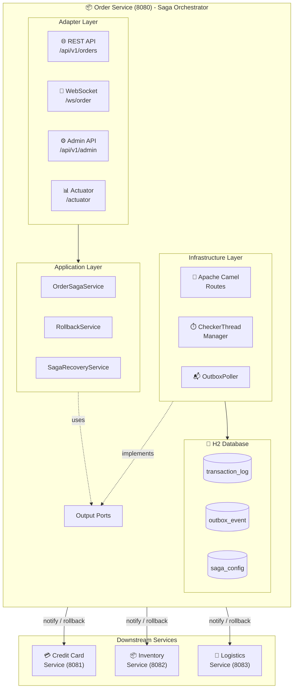
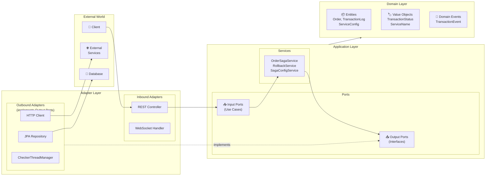
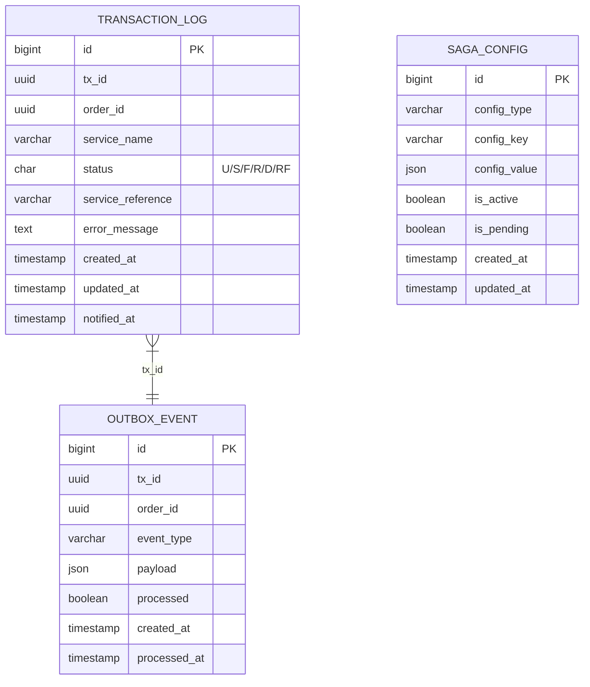
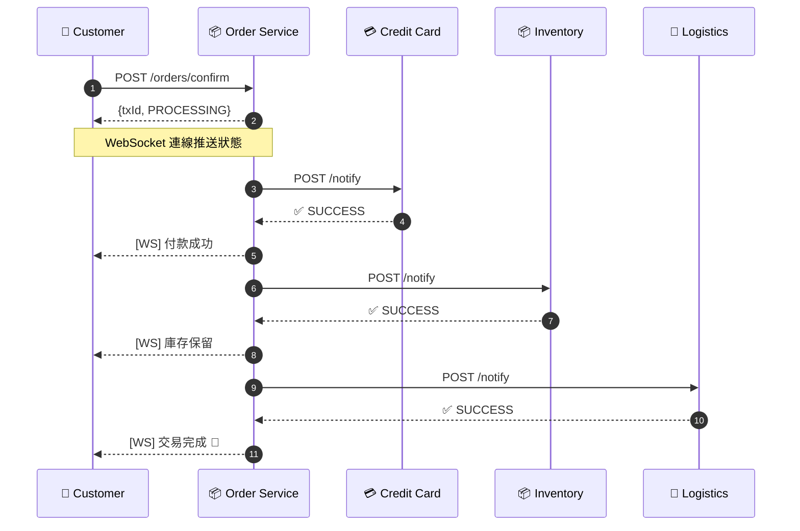
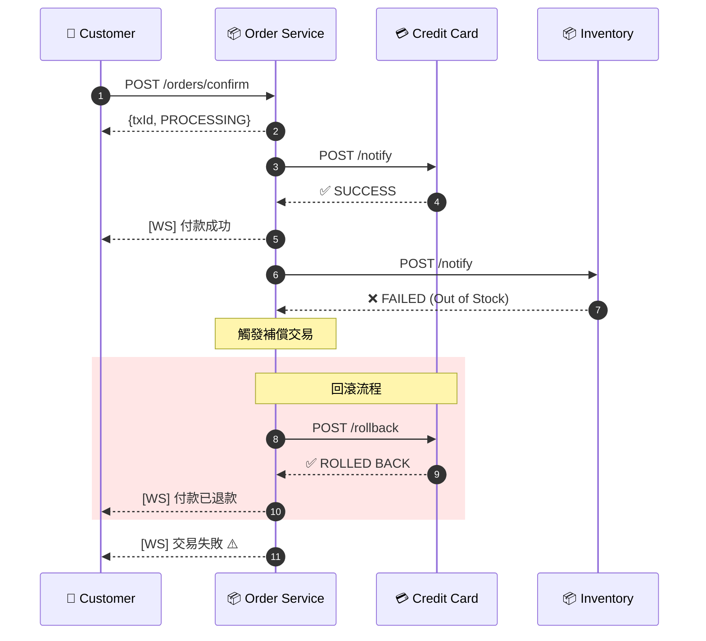
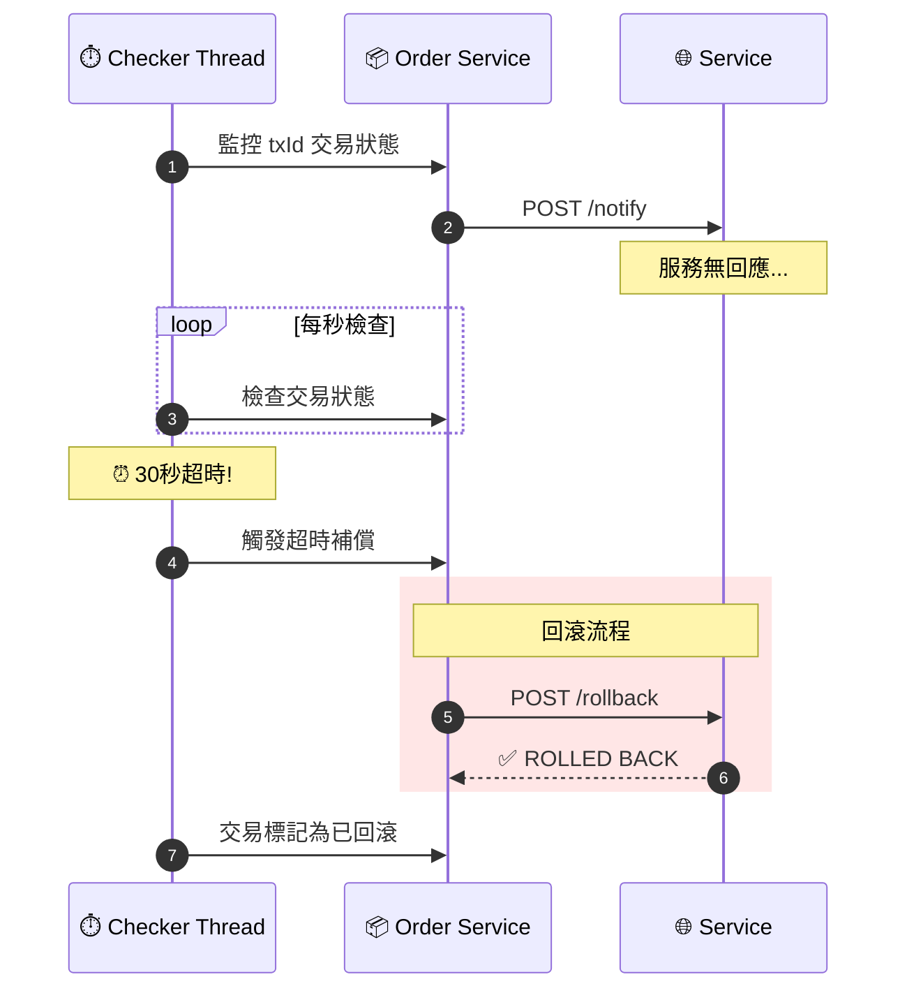
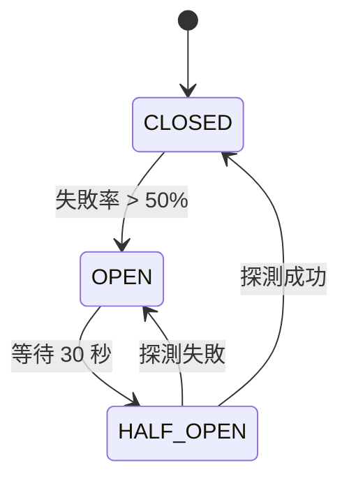
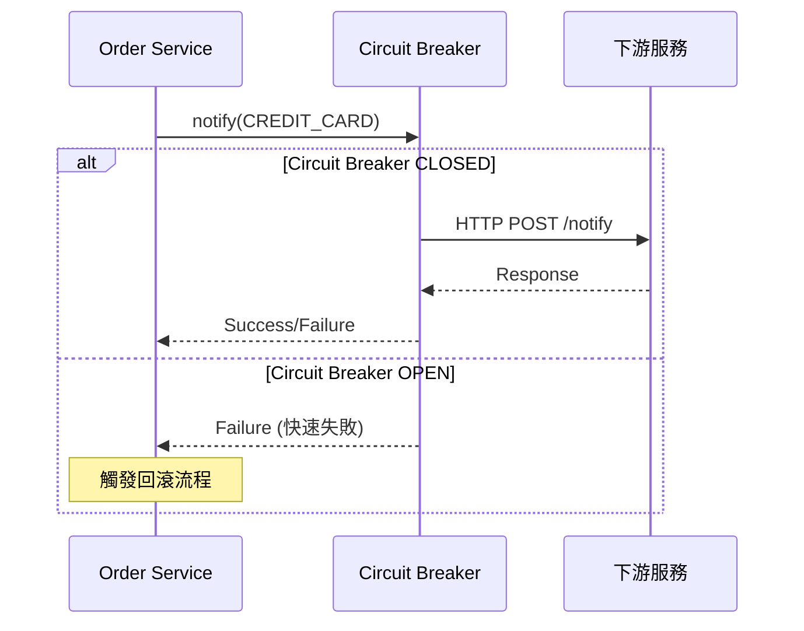

# E-Commerce Saga Orchestration System

電子商務 Saga 編排系統 - 使用 Saga 模式實現分散式交易的自動補償機制。

---

## 🌿 分支說明

本專案提供兩種不同的實作方式，請依需求切換分支查看：

| 分支 | 通訊方式 | 說明 | 切換指令 |
|------|----------|------|----------|
| **`main`** (目前分支) | HTTP 同步 | 原始設計，使用 HTTP REST 呼叫下游服務 | `git checkout main` |
| **`feature/kafka-cdc`** | Kafka 非同步 | 進階設計，使用 Kafka + Debezium CDC 實現事件驅動架構 | `git checkout feature/kafka-cdc` |

### 📌 本分支：`main` - HTTP 同步通訊

此分支實作 **HTTP 同步呼叫** 的 Saga 編排模式：

- **通訊方式**：Order Service 透過 HTTP REST API 直接呼叫下游服務
- **優點**：實作簡單、易於理解和除錯
- **適用場景**：服務數量少、延遲要求不高的場景
- **技術棧**：Spring Boot + Apache Camel + Resilience4j

```
Order Service ──HTTP──> Credit Card Service
              ──HTTP──> Inventory Service
              ──HTTP──> Logistics Service
```

> 💡 若需查看 **Kafka CDC 非同步版本**，請執行：`git checkout feature/kafka-cdc`

---

## 專案狀態


| 階段 | 狀態 | 說明 |
|------|------|------|
| Phase 1-3 | ✅ 完成 | 基礎架構、領域模型、端口與適配器 |
| Phase 4 | ✅ 完成 | 回滾機制與 Camel 路由 |
| Phase 5 | ✅ 完成 | 超時檢測與自動補償 |
| Phase 6 | ✅ 完成 | 回滾失敗升級通知 |
| Phase 7 | ✅ 完成 | 服務重啟後恢復 |
| Phase 8 | ✅ 完成 | 動態服務配置 API |
| Phase 9 | ✅ 完成 | 可觀測性與驗收測試 |

---

## 系統架構



### 六角形架構 (Hexagonal Architecture)



> **依賴倒轉原則 (DIP)**: Application Layer 定義 Output Ports (介面)，Infrastructure/Adapter Layer 實現這些介面。Application Layer 不直接依賴 Infrastructure Layer。

---

## 技術棧

| 類別 | 技術 | 版本 | 用途 |
|------|------|------|------|
| **語言** | Java | 21 | 主要開發語言 |
| **框架** | Spring Boot | 3.2.x | 應用程式框架 |
| **編排引擎** | Apache Camel | 4.x | Saga 流程編排 |
| **熔斷器** | Resilience4j | 2.2.x | Circuit Breaker 保護下游服務 |
| **資料庫** | H2 Database | - | 嵌入式資料庫 (事件溯源) |
| **ORM** | Spring Data JPA | - | 資料存取層 |
| **即時通訊** | WebSocket | - | 交易狀態即時推送 |
| **API 文件** | SpringDoc OpenAPI | 2.x | Swagger UI |
| **監控** | Micrometer + Actuator | - | 指標收集與健康檢查 |
| **建置工具** | Gradle | 8.5 | 專案建置管理 |
| **測試** | JUnit 5 + Mockito | - | 單元/整合測試 |

---

## 資料庫設計

### ER Diagram



### 交易狀態 (TransactionStatus)

| 狀態碼 | 名稱 | 說明 |
|--------|------|------|
| `U` | UNKNOWN | 處理中/未知 |
| `S` | SUCCESS | 成功完成 |
| `F` | FAILED | 執行失敗 |
| `R` | ROLLED_BACK | 已回滾 |
| `D` | DONE | 交易完成 (含回滾) |
| `RF` | ROLLBACK_FAILED | 回滾失敗 |

---

## API 清單

### Order Service (Port 8080)

#### 訂單 API

| Method | Endpoint | 說明 |
|--------|----------|------|
| `POST` | `/api/v1/orders/confirm` | 確認訂單，啟動 Saga 流程 |
| `GET` | `/api/v1/transactions/{txId}` | 依交易 ID 查詢交易狀態 |
| `GET` | `/api/v1/transactions/orders/{orderId}/history` | 依訂單 ID 查詢所有交易歷史 |

#### 管理員配置 API

| Method | Endpoint | 說明 |
|--------|----------|------|
| `GET` | `/api/v1/admin/config/active` | 取得當前生效配置 |
| `GET` | `/api/v1/admin/config/pending` | 取得待生效配置 |
| `PUT` | `/api/v1/admin/config/pending` | 更新待生效配置 |
| `POST` | `/api/v1/admin/config/apply` | 套用待生效配置 |
| `DELETE` | `/api/v1/admin/config/pending` | 捨棄待生效配置 |
| `GET` | `/api/v1/admin/config/timeouts` | 取得服務超時設定 |
| `GET` | `/api/v1/admin/config/order` | 取得服務執行順序 |

#### WebSocket

| Endpoint | 說明 |
|----------|------|
| `ws://localhost:8080/ws/order/{txId}` | 訂閱交易狀態更新 |

#### Actuator 端點

| Endpoint | 說明 |
|----------|------|
| `/actuator/health` | 健康檢查 (含 Circuit Breaker 狀態) |
| `/actuator/info` | 應用程式資訊 |
| `/actuator/metrics` | 指標數據 |
| `/actuator/prometheus` | Prometheus 格式指標 |
| `/actuator/circuitbreakers` | Circuit Breaker 狀態總覽 |
| `/actuator/circuitbreakerevents` | Circuit Breaker 事件記錄 |

### 下游服務 API

| Service | Port | Notify Endpoint | Rollback Endpoint |
|---------|------|-----------------|-------------------|
| Credit Card | 8081 | `POST /api/v1/credit-card/notify` | `POST /api/v1/credit-card/rollback` |
| Inventory | 8082 | `POST /api/v1/inventory/notify` | `POST /api/v1/inventory/rollback` |
| Logistics | 8083 | `POST /api/v1/logistics/notify` | `POST /api/v1/logistics/rollback` |

---

## Swagger UI

啟動服務後，可透過以下網址存取 API 文件：

| 服務 | Swagger UI URL |
|------|----------------|
| Order Service | http://localhost:8080/swagger-ui.html |
| API Docs (JSON) | http://localhost:8080/api-docs |

### 使用範例

```bash
# 1. 確認訂單
curl -X POST http://localhost:8080/api/v1/orders/confirm \
  -H "Content-Type: application/json" \
  -d '{
    "orderId": "550e8400-e29b-41d4-a716-446655440000",
    "userId": "user-123",
    "items": [
      {"sku": "SKU-001", "quantity": 2, "unitPrice": 29.99}
    ],
    "totalAmount": 59.98,
    "creditCardNumber": "4111111111111111"
  }'

# Response:
# {"txId": "a1b2c3d4-...", "status": "PROCESSING"}

# 2. 依交易 ID 查詢交易狀態
curl http://localhost:8080/api/v1/transactions/{txId}

# 3. 依訂單 ID 查詢所有交易歷史 (支援重試場景)
curl http://localhost:8080/api/v1/transactions/orders/{orderId}/history

# Response:
# {
#   "orderId": "550e8400-e29b-41d4-a716-446655440000",
#   "totalTransactions": 2,
#   "transactions": [
#     {"txId": "tx-1", "overallStatus": "ROLLED_BACK", "startedAt": "...", "services": [...]},
#     {"txId": "tx-2", "overallStatus": "COMPLETED", "startedAt": "...", "services": [...]}
#   ]
# }

# 4. 取得服務配置
curl http://localhost:8080/api/v1/admin/config/active
```

---

## 使用案例

### UC1: 訂單確認成功流程



### UC2: 服務失敗自動回滾



### UC3: 超時檢測與補償



---

## 特色功能

### 1. Saga 編排模式
- 中央協調者控制分散式交易流程
- 支援動態服務順序配置
- 使用 Apache Camel 實現流程編排

### 2. 自動補償機制
- 服務失敗時自動觸發回滾
- 回滾順序與執行順序相反
- 單一服務回滾失敗不影響其他服務

### 3. 超時檢測
- 每筆交易獨立監控執行緒
- 可配置每個服務的超時時間
- 超時自動觸發補償流程

### 4. 失敗升級通知
- 回滾重試機制 (預設 5 次)
- 指數退避重試策略
- 重試耗盡後通知管理員

### 5. 崩潰恢復
- 服務重啟時自動掃描未完成交易
- 恢復監控執行緒繼續追蹤
- 確保交易最終一致性

### 6. 動態配置
- 支援 active/pending 配置模式
- 不需重啟即可更新配置
- 新交易使用新配置，進行中交易不受影響

### 7. 即時狀態推送
- WebSocket 即時通知交易狀態變更
- 支援多客戶端同時訂閱
- 中文化狀態訊息

### 8. 可觀測性
- Micrometer 指標收集
- 結構化日誌 (txId 關聯)
- Prometheus 格式輸出
- Spring Boot Actuator 健康檢查

### 9. Resilience4j 彈性套件
- **Circuit Breaker** - 熔斷保護，防止級聯故障
- **Retry** - 自動重試暫時性故障 (指數退避)
- **Bulkhead** - 艙壁隔離，限制並發數
- 獨立 instance (CREDIT_CARD、INVENTORY、LOGISTICS)
- Grafana Dashboard 視覺化監控

---

## 快速開始

### 環境需求
- Java 21+
- Gradle 8.5+

### 建置與執行

```bash
# 建置專案
./gradlew clean build

# 啟動 Order Service
./gradlew :order-service:bootRun

# 啟動下游服務 (各開一個終端機)
./gradlew :credit-card-service:bootRun
./gradlew :inventory-service:bootRun
./gradlew :logistics-service:bootRun
```

### 存取服務

| 服務 | URL |
|------|-----|
| Order Service | http://localhost:8080 |
| Swagger UI | http://localhost:8080/swagger-ui.html |
| H2 Console | http://localhost:8080/h2-console |
| Health Check | http://localhost:8080/actuator/health |

---

## 測試

### 測試框架

| 框架 | 用途 |
|------|------|
| JUnit 5 | 單元測試框架 |
| Mockito | Mock 框架 |
| Cucumber | BDD 測試框架 |
| Spring Boot Test | 整合測試 |
| AssertJ | 斷言函式庫 |

### 執行測試

```bash
# 執行所有測試
./gradlew test

# 執行特定服務的測試
./gradlew :order-service:test
./gradlew :credit-card-service:test
./gradlew :inventory-service:test
./gradlew :logistics-service:test

# 產生測試報告
./gradlew test jacocoTestReport
```

### BDD 測試案例

所有 BDD 測試使用繁體中文 Gherkin 語法撰寫，涵蓋正向與反向測試場景。

#### Credit Card Service (信用卡服務)

| 標籤 | 場景 | 說明 |
|------|------|------|
| `@positive @happy-path` | 成功處理付款請求 | 驗證有效付款請求能成功處理並返回授權碼 |
| `@positive @idempotent` | 冪等性 - 重複付款請求返回相同結果 | 驗證相同交易ID的重複請求只處理一次付款 |
| `@positive @rollback` | 成功退款已付款的交易 | 驗證已付款交易能成功退款 |
| `@positive @rollback-idempotent` | 冪等性 - 重複退款請求返回相同結果 | 驗證重複退款請求的冪等性處理 |
| `@negative @no-payment` | 退款不存在的付款 - 無操作 | 驗證對不存在的付款退款時的安全處理 |
| `@negative @failure-simulation` | 模擬付款失敗 | 驗證付款失敗時的錯誤處理 |

<details>
<summary>查看完整測試場景 (payment.feature)</summary>

```gherkin
# language: zh-TW
@payment
功能: 信用卡付款處理
  作為電子商務系統
  我需要處理信用卡付款
  以便完成訂單交易

  背景:
    假設 信用卡服務已啟動

  @positive @happy-path
  場景: 成功處理付款請求
    假設 一個有效的付款請求，交易ID為 "550e8400-e29b-41d4-a716-446655440001"
    當 發送付款通知請求
    那麼 應該收到成功的付款回應
    而且 回應應包含授權碼

  @positive @idempotent
  場景: 冪等性 - 重複付款請求返回相同結果
    假設 一個有效的付款請求，交易ID為 "550e8400-e29b-41d4-a716-446655440002"
    當 發送付款通知請求
    而且 再次發送相同的付款通知請求
    那麼 兩次回應應該相同
    而且 應該只處理一次付款

  @positive @rollback
  場景: 成功退款已付款的交易
    假設 一個有效的付款請求，交易ID為 "550e8400-e29b-41d4-a716-446655440003"
    當 發送付款通知請求
    而且 收到成功的付款回應
    當 發送退款請求
    那麼 應該收到成功的退款回應
    而且 退款訊息應為 "Payment refunded successfully"

  @negative @failure-simulation
  場景: 模擬付款失敗
    假設 信用卡服務配置為失敗模式
    假設 一個有效的付款請求，交易ID為 "550e8400-e29b-41d4-a716-446655440006"
    當 發送付款通知請求
    那麼 應該收到失敗的付款回應
    而且 失敗訊息應包含 "Payment declined"
```

</details>

#### Inventory Service (庫存服務)

| 標籤 | 場景 | 說明 |
|------|------|------|
| `@positive @happy-path` | 成功預留庫存 | 驗證有效庫存預留請求能成功處理並返回預留編號 |
| `@positive @idempotent` | 冪等性 - 重複預留請求返回相同結果 | 驗證相同交易ID的重複請求只預留一次庫存 |
| `@positive @rollback` | 成功釋放已預留的庫存 | 驗證已預留庫存能成功釋放 |
| `@positive @rollback-idempotent` | 冪等性 - 重複釋放請求返回相同結果 | 驗證重複釋放請求的冪等性處理 |
| `@negative @no-reservation` | 釋放不存在的預留 - 無操作 | 驗證對不存在的預留釋放時的安全處理 |
| `@negative @failure-simulation` | 模擬庫存不足失敗 | 驗證庫存不足時的錯誤處理 |

<details>
<summary>查看完整測試場景 (inventory.feature)</summary>

```gherkin
# language: zh-TW
@inventory
功能: 庫存管理
  作為電子商務系統
  我需要管理商品庫存
  以便確保訂單能正確預留和釋放庫存

  背景:
    假設 庫存服務已啟動

  @positive @happy-path
  場景: 成功預留庫存
    假設 一個有效的庫存預留請求，交易ID為 "660e8400-e29b-41d4-a716-446655440001"
    當 發送庫存預留請求
    那麼 應該收到成功的預留回應
    而且 回應應包含預留編號

  @positive @idempotent
  場景: 冪等性 - 重複預留請求返回相同結果
    假設 一個有效的庫存預留請求，交易ID為 "660e8400-e29b-41d4-a716-446655440002"
    當 發送庫存預留請求
    而且 再次發送相同的庫存預留請求
    那麼 兩次預留回應應該相同
    而且 應該只預留一次庫存

  @positive @rollback
  場景: 成功釋放已預留的庫存
    假設 一個有效的庫存預留請求，交易ID為 "660e8400-e29b-41d4-a716-446655440003"
    當 發送庫存預留請求
    而且 收到成功的預留回應
    當 發送庫存釋放請求
    那麼 應該收到成功的釋放回應
    而且 釋放訊息應為 "Inventory released successfully"

  @negative @failure-simulation
  場景: 模擬庫存不足失敗
    假設 庫存服務配置為失敗模式
    假設 一個有效的庫存預留請求，交易ID為 "660e8400-e29b-41d4-a716-446655440006"
    當 發送庫存預留請求
    那麼 應該收到失敗的預留回應
    而且 失敗訊息應包含 "Out of stock"
```

</details>

#### Logistics Service (物流服務)

| 標籤 | 場景 | 說明 |
|------|------|------|
| `@positive @happy-path` | 成功安排運送 | 驗證有效運送請求能成功處理並返回追蹤編號 |
| `@positive @idempotent` | 冪等性 - 重複運送請求返回相同結果 | 驗證相同交易ID的重複請求只安排一次運送 |
| `@positive @rollback` | 成功取消已安排的運送 | 驗證已安排運送能成功取消 |
| `@positive @rollback-idempotent` | 冪等性 - 重複取消請求返回相同結果 | 驗證重複取消請求的冪等性處理 |
| `@negative @no-shipment` | 取消不存在的運送 - 無操作 | 驗證對不存在的運送取消時的安全處理 |
| `@negative @failure-simulation` | 模擬物流公司無法配送失敗 | 驗證配送失敗時的錯誤處理 |

<details>
<summary>查看完整測試場景 (logistics.feature)</summary>

```gherkin
# language: zh-TW
@logistics
功能: 物流運送管理
  作為電子商務系統
  我需要管理訂單配送
  以便確保商品能正確安排運送和取消

  背景:
    假設 物流服務已啟動

  @positive @happy-path
  場景: 成功安排運送
    假設 一個有效的運送請求，交易ID為 "770e8400-e29b-41d4-a716-446655440001"
    當 發送運送安排請求
    那麼 應該收到成功的運送回應
    而且 回應應包含物流追蹤編號

  @positive @idempotent
  場景: 冪等性 - 重複運送請求返回相同結果
    假設 一個有效的運送請求，交易ID為 "770e8400-e29b-41d4-a716-446655440002"
    當 發送運送安排請求
    而且 再次發送相同的運送安排請求
    那麼 兩次運送回應應該相同
    而且 應該只安排一次運送

  @positive @rollback
  場景: 成功取消已安排的運送
    假設 一個有效的運送請求，交易ID為 "770e8400-e29b-41d4-a716-446655440003"
    當 發送運送安排請求
    而且 收到成功的運送回應
    當 發送取消運送請求
    那麼 應該收到成功的取消回應
    而且 取消訊息應為 "Shipment cancelled successfully"

  @negative @failure-simulation
  場景: 模擬物流公司無法配送失敗
    假設 物流服務配置為失敗模式
    假設 一個有效的運送請求，交易ID為 "770e8400-e29b-41d4-a716-446655440006"
    當 發送運送安排請求
    那麼 應該收到失敗的運送回應
    而且 失敗訊息應包含 "Carrier unavailable"
```

</details>

#### Order Service (訂單服務 - Saga 協調者)

| 標籤 | 場景 | 說明 |
|------|------|------|
| `@positive @happy-path` | 成功完成訂單確認流程 | 驗證有效訂單能成功啟動 Saga 流程 |
| `@positive @transaction-query` | 查詢交易狀態 | 驗證能正確查詢已提交交易的狀態 |
| `@negative @invalid-request` | 拒絕無效的訂單請求 | 驗證無效請求被正確拒絕 |
| `@positive @config` | 取得服務配置 | 驗證能正確取得當前生效的服務配置 |
| `@positive @config` | 取得服務超時設定 | 驗證能正確取得各服務的超時設定 |
| `@positive @config` | 取得服務執行順序 | 驗證能正確取得服務執行順序 |

<details>
<summary>查看完整測試場景 (saga-orchestration.feature)</summary>

```gherkin
# language: zh-TW
@saga @orchestration
功能: Saga 交易編排
  作為電子商務系統
  我需要協調分散式交易
  以便確保訂單流程的一致性

  背景:
    假設 訂單服務已啟動
    而且 所有下游服務已可用

  @positive @happy-path
  場景: 成功完成訂單確認流程
    假設 一個有效的訂單確認請求
    當 發送訂單確認請求
    那麼 應該收到處理中的回應
    而且 回應應包含交易ID

  @positive @transaction-query
  場景: 查詢交易狀態
    假設 一個已提交的訂單交易
    當 查詢該交易狀態
    那麼 應該收到交易狀態資訊
    而且 狀態應包含交易ID

  @negative @invalid-request
  場景: 拒絕無效的訂單請求
    假設 一個缺少必要欄位的訂單請求
    當 發送無效的訂單確認請求
    那麼 應該收到錯誤回應

  @positive @config
  場景: 取得服務配置
    當 取得當前生效配置
    那麼 應該收到配置資訊
    而且 配置應包含服務順序

  @positive @config
  場景: 取得服務超時設定
    當 取得服務超時設定
    那麼 應該收到超時配置
    而且 每個服務都應有超時值

  @positive @config
  場景: 取得服務執行順序
    當 取得服務執行順序
    那麼 應該收到服務順序列表
    而且 列表應包含信用卡、庫存和物流服務
```

</details>

### 單元測試

| 服務 | 測試類別 | 測試內容 |
|------|----------|----------|
| order-service | `WebSocketAdapterTest` | WebSocket 訊息發送、狀態更新 |
| order-service | `OutboxPollerTest` | Outbox 事件輪詢與處理 |
| credit-card-service | `CreditCardServiceTest` | 付款處理邏輯、冪等性 |
| credit-card-service | `CreditCardControllerTest` | REST API 端點測試 |
| inventory-service | `InventoryServiceTest` | 庫存預留與釋放邏輯 |
| inventory-service | `InventoryControllerTest` | REST API 端點測試 |
| logistics-service | `LogisticsServiceTest` | 運送安排與取消邏輯 |
| logistics-service | `LogisticsControllerTest` | REST API 端點測試 |

### 測試涵蓋範圍

```
┌─────────────────────────────────────────────────────────────────┐
│                      測試金字塔                                   │
├─────────────────────────────────────────────────────────────────┤
│                         ▲                                        │
│                        /E\        E2E 測試 (手動)                 │
│                       /───\                                      │
│                      /     \                                     │
│                     / BDD   \     BDD 整合測試 (自動化)           │
│                    /─────────\    - 4 個服務 × 6 場景             │
│                   /           \                                  │
│                  /   單元測試   \  單元測試 (自動化)               │
│                 /───────────────\ - Service, Controller, Adapter │
│                /                 \                               │
└─────────────────────────────────────────────────────────────────┘
```

---

## Circuit Breaker 整合

本專案使用 Resilience4j 實現 Circuit Breaker 模式，保護下游服務呼叫，防止級聯故障。

### 狀態轉移圖



### 配置參數

| 參數 | 值 | 說明 |
|------|-----|------|
| `failure-rate-threshold` | 50% | 失敗率超過此閾值時開啟熔斷 |
| `sliding-window-size` | 10 | 評估最近 N 次呼叫 |
| `minimum-number-of-calls` | 5 | 至少 N 次呼叫後才評估 |
| `wait-duration-in-open-state` | 30s | OPEN 狀態等待時間 |
| `permitted-number-of-calls-in-half-open-state` | 3 | HALF_OPEN 狀態允許的探測次數 |
| `slow-call-rate-threshold` | 50% | 慢呼叫比例閾值 |
| `slow-call-duration-threshold` | 10s | 慢呼叫時間閾值 |

### 服務熔斷器

每個下游服務有獨立的 Circuit Breaker instance：

| 服務 | Circuit Breaker Name | 用途 |
|------|---------------------|------|
| Credit Card | `CREDIT_CARD` | 保護付款服務呼叫 |
| Inventory | `INVENTORY` | 保護庫存服務呼叫 |
| Logistics | `LOGISTICS` | 保護物流服務呼叫 |

### 監控 Circuit Breaker

```bash
# 查看健康狀態 (含 Circuit Breaker)
curl http://localhost:8080/actuator/health

# 查看所有 Circuit Breaker 狀態
curl http://localhost:8080/actuator/circuitbreakers

# 查看特定 Circuit Breaker 狀態
curl http://localhost:8080/actuator/circuitbreakers/CREDIT_CARD

# 查看 Circuit Breaker 事件記錄
curl http://localhost:8080/actuator/circuitbreakerevents

# 查看特定 Circuit Breaker 的事件
curl http://localhost:8080/actuator/circuitbreakerevents/CREDIT_CARD
```

### 回應範例

**健康檢查 (含 Circuit Breaker 狀態)**
```json
{
  "status": "UP",
  "components": {
    "circuitBreakers": {
      "status": "UP",
      "details": {
        "CREDIT_CARD": {
          "status": "UP",
          "details": {
            "state": "CLOSED",
            "failureRate": "-1.0%",
            "slowCallRate": "-1.0%",
            "bufferedCalls": 0,
            "failedCalls": 0
          }
        }
      }
    }
  }
}
```

**Circuit Breaker 狀態**
```json
{
  "circuitBreakers": {
    "CREDIT_CARD": {
      "state": "CLOSED",
      "failureRateThreshold": 50.0,
      "slowCallRateThreshold": 50.0,
      "bufferedCalls": 5,
      "failedCalls": 1,
      "slowCalls": 0,
      "notPermittedCalls": 0
    }
  }
}
```

### 熔斷時的行為

當 Circuit Breaker 處於 OPEN 狀態時：

1. **不發送 HTTP 請求** - 直接返回失敗回應
2. **快速失敗** - 避免等待超時
3. **日誌記錄** - 記錄 WARN 級別日誌
4. **回應訊息** - 返回 "Circuit breaker is OPEN for {服務名稱}"

```
WARN - txId=xxx - Circuit breaker OPEN for service CREDIT_CARD, skipping HTTP call
```

### 與 Saga 的整合

Circuit Breaker 與 Saga 回滾機制無縫整合：

1. **notify 失敗 (CB OPEN)** → 視為服務失敗 → 觸發已完成服務的回滾
2. **rollback 失敗 (CB OPEN)** → 重試機制生效 → 最終通知管理員



---

## Retry 機制

Resilience4j Retry 提供自動重試功能，處理暫時性故障。

### 配置參數

| 參數 | 值 | 說明 |
|------|-----|------|
| `max-attempts` | 3 | 最大嘗試次數 (含首次) |
| `wait-duration` | 1s | 重試間隔 |
| `exponential-backoff-multiplier` | 2 | 指數退避乘數 |
| `exponential-max-wait-duration` | 10s | 最大等待時間 |

### 重試例外

僅對以下例外進行重試：
- `ResourceAccessException` - 連線失敗
- `ConnectException` - 無法連線
- `SocketTimeoutException` - 連線逾時

HTTP 4xx 錯誤 (`HttpClientErrorException`) 不會重試。

### 監控 Retry

```bash
# 查看 Retry 狀態
curl http://localhost:8080/actuator/retries

# 查看 Retry 事件
curl http://localhost:8080/actuator/retryevents
```

---

## Bulkhead 艙壁隔離

Bulkhead 模式限制並發呼叫數，防止單一服務耗盡所有資源。

### 配置參數

| 服務 | max-concurrent-calls | max-wait-duration |
|------|---------------------|-------------------|
| CREDIT_CARD | 15 | 500ms |
| INVENTORY | 20 | 500ms |
| LOGISTICS | 10 | 500ms |

### 行為說明

- 當並發數達到上限時，新請求等待最多 500ms
- 等待超時後拋出 `BulkheadFullException`
- 返回 "Service {name} is overloaded" 錯誤

### 監控 Bulkhead

```bash
# 查看 Bulkhead 狀態
curl http://localhost:8080/actuator/bulkheads
```

---

## Resilience4j 裝飾器順序

下游服務呼叫的保護順序：

```
Request → Bulkhead → Retry → CircuitBreaker → HTTP Call
```

1. **Bulkhead** - 限制並發，防止資源耗盡
2. **Retry** - 自動重試暫時性故障
3. **CircuitBreaker** - 熔斷保護，快速失敗

---

## Grafana Dashboard

專案提供預設的 Grafana Dashboard 配置，監控 Resilience4j 指標。

### 匯入 Dashboard

```bash
# Dashboard 檔案位置
monitoring/grafana/dashboards/resilience4j-dashboard.json
```

1. 開啟 Grafana → Dashboards → Import
2. 上傳 JSON 檔案
3. 選擇 Prometheus 資料來源

### Dashboard Panels

| Panel | 說明 |
|-------|------|
| Circuit Breaker State | 各服務熔斷器狀態 |
| Failure Rate | 失敗率趨勢圖 |
| Retry Events | 重試事件統計 |
| Bulkhead Gauges | 可用並發數儀表 |
| Saga Duration | 交易延遲 p95/p99 |

### Prometheus 指標範例

```promql
# Circuit Breaker 狀態
resilience4j_circuitbreaker_state{name="CREDIT_CARD"}

# Retry 成功率
rate(resilience4j_retry_calls_total{kind="successful_without_retry"}[5m])

# Bulkhead 使用率
resilience4j_bulkhead_available_concurrent_calls{name="CREDIT_CARD"}
```

詳細說明請參考 [monitoring/README.md](monitoring/README.md)。

---

## 專案結構

```
ecom-saga-poc/
├── common/                          # 共用模組
│   └── src/main/java/
│       └── com/ecommerce/common/
│           ├── domain/              # 共用領域物件
│           ├── dto/                 # 共用 DTO
│           └── exception/           # 共用例外
│
├── order-service/                   # Saga 協調者
│   └── src/main/java/
│       └── com/ecommerce/order/
│           ├── adapter/
│           │   ├── in/web/          # REST Controllers
│           │   ├── in/websocket/    # WebSocket Handler
│           │   └── out/             # Persistence/Service Adapters
│           ├── application/
│           │   ├── port/in/         # Use Case Interfaces
│           │   ├── port/out/        # Output Port Interfaces
│           │   │   ├── CheckerPort.java
│           │   │   ├── RollbackExecutorPort.java
│           │   │   ├── TransactionLogPort.java
│           │   │   └── ...
│           │   └── service/         # Application Services
│           ├── domain/
│           │   ├── model/           # Domain Entities
│           │   └── event/           # Domain Events
│           └── infrastructure/      # Implements Output Ports (DIP)
│               ├── camel/           # Camel Routes & Processors
│               ├── checker/         # CheckerPort 實現
│               ├── config/          # Spring Configurations
│               ├── observability/   # Metrics & Tracing
│               ├── poller/          # Outbox Poller
│               └── recovery/        # Startup Recovery
│
├── credit-card-service/             # 信用卡服務
├── inventory-service/               # 庫存服務
├── logistics-service/               # 物流服務
│
└── specs/                           # 設計規格文件
    └── 001-saga-orchestration/
        ├── spec.md
        ├── plan.md
        └── tasks.md
```

---

## 授權

MIT License
